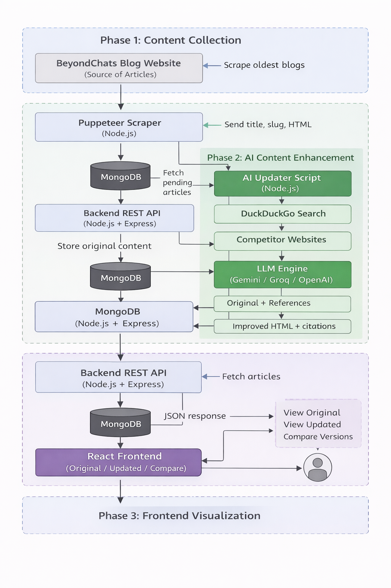

# 🧠 BeyondChats – AI-Powered Blog Intelligence System

This project is an end-to-end system built as part of the **BeyondChats technical assignment**.  
It focuses on **scraping, improving, and presenting blog content using AI-driven competitive analysis**.

The goal of this project is not just automation, but to demonstrate how AI can be used **responsibly and practically** to improve existing content rather than replace it.

---

## 🚀 Project Overview

Over time, blog articles tend to lose relevance due to:
- outdated structure
- weaker SEO practices
- shallow or uncompetitive content

This project demonstrates how AI can be used to **revive and enhance existing blog content** by learning from better-performing articles on the web.

### What this system does
- Scrapes the **oldest blogs** from BeyondChats
- Stores them in a database
- Uses AI to enhance content using competitive references
- Displays original and updated versions in a clean, professional UI
- Allows **side-by-side comparison** for transparency

---

## 🧩 Architecture Overview



## 🛠️ Tech Stack

### Backend
- **Node.js**
- **Express**
- **MongoDB + Mongoose**
- **Puppeteer**
- **Axios**
- **CORS**

### AI & Automation
- **Google Gemini (Flash 2.5)**
- **DuckDuckGo search scraping**
- **Competitive content analysis**

### Frontend
- **React (Vite)**
- **Modern CSS (Grid, animations, modals)**
- **Responsive UI**
- **Z-axis modal overlays**
- **Side-by-side comparison views**

---

## 📌 Phase-wise Breakdown

---

### ✅ Phase 1 – Blog Scraping & CRUD APIs

**Objective**  
Scrape the oldest blog articles from BeyondChats and store them in a database with CRUD access.

**Implementation**
- Navigated to the last page of the BeyondChats blogs section using Puppeteer
- Scraped the 5 oldest blog articles
- Extracted:
  - title
  - slug
  - original HTML content
- Stored articles in MongoDB
- Built REST APIs to:
  - create articles
  - fetch all articles
  - fetch article by ID
  - update articles

---

### 🤖 Phase 2 – AI Article Updater (Core Intelligence)

**Objective**  
Enhance existing blog articles using AI and competitive analysis.

**Process Flow**
1. Fetch unprocessed articles from backend APIs
2. Search the article title on DuckDuckGo
3. Select the top 2 valid external reference articles
4. Scrape the main content of those references
5. Use Gemini AI to:
   - improve structure and clarity
   - enhance depth and readability
   - preserve originality (no plagiarism)
6. Publish the updated article back to the backend
7. Store reference links for transparency

**Key Design Choice**
- AI is used as an **editor**, not a generator
- No copying of external content
- References are cited at the end of updated articles

---

### 🎨 Phase 3 – Frontend UI (Visualization Layer)

**Objective**  
Create a responsive, professional interface to explore and compare articles.

**Features**
- Animated hero section
- Article cards with update status
- Z-axis modal overlays (true overlays using portals)
- View modes:
  - Original blog
  - AI-updated blog
  - Side-by-side comparison
- Scroll-safe modals and clean UX
- Responsive grid layout

---

## 📸 Screenshots (Add These)

> 📌 **You must add screenshots here**  
Create a folder called `/screenshots` in the root of the repo.

### Homepage


### View Updated Blog


### Compare View


*(Screenshots help reviewers verify functionality quickly and carry strong weight.)*

---

## 🧪 Running the Project Locally

### Backend
```bash
cd backend
npm install
npm run dev
